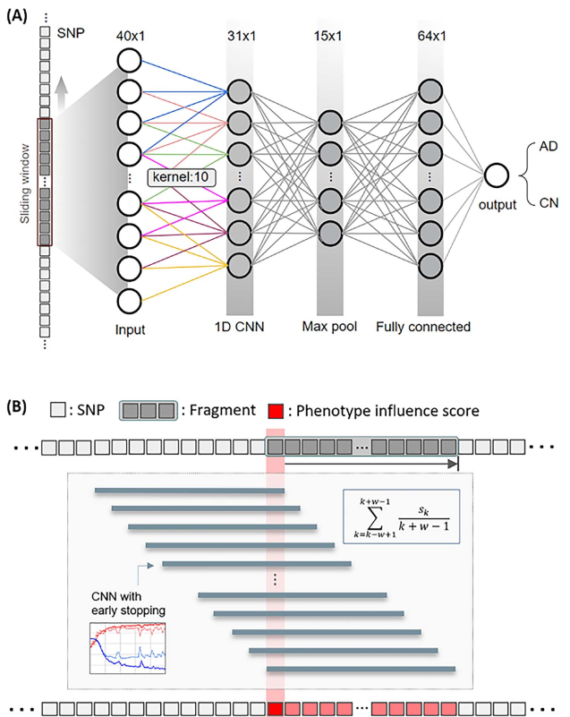

# Repository Moved
This repository has been moved to [SWAT](https://github.com/taehojo/SWAT). 

# SWAT-CNN
A novel three-step approach for identification of genetic variants using deep learning to identify phenotype-related SNPs that can be applied to develop accurate disease classification models. 

**SWAT**(Sliding Window Association Test)**-CNN** is a data-customized approach. We demonstrate how SWAT-CNN can be applied to GWAS data in the following paper.

- Jo, T., Nho, K., Bice, P., Saykin, A. J., & Alzheimer’s Disease Neuroimaging Initiative. (2022). Deep learning-based identification of genetic variants: application to Alzheimer’s disease classification. *Briefings in Bioinformatics*, *23*(2), bbac022.
